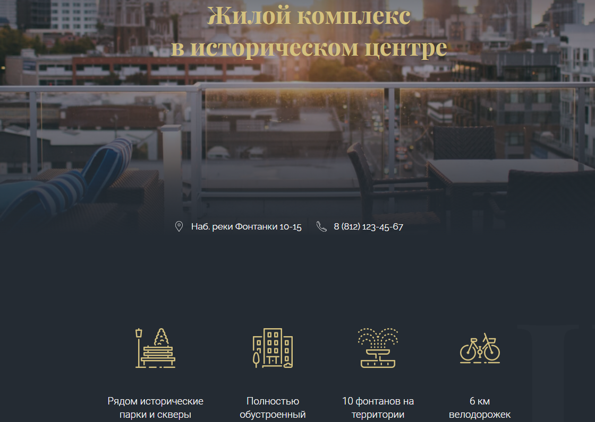

**Адаптивная лендинговая страница застройщика**

//Ссылки для перехода на новые страницы не активны, но имеют состояние - hover

* каждый блок стилизации в scss вынесен в отдельный файл
* скролл для ссылок из header / footer
* кнопка для возврата наверх страницы
* подключен блок для генерации Яндекс карты
* Использован плагин youtubeLightBox для воспроизведения видео на самом сайте без перехода на YouTube
* маска для номера телефона
* необходимость валидировать инпут для отправки данных 
* адаптивен под разную ширину экрана (media-queries)

Посмотреть онлайн: https://alinak96.github.io/Landing---LoftHouse/  
 

